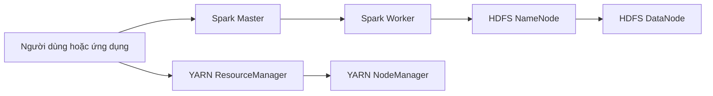
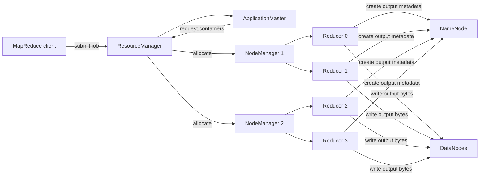
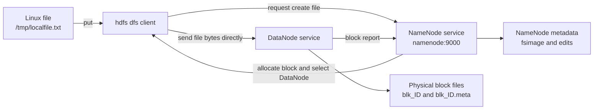

# BÁO CÁO CÀI ĐẶT CỤM HADOOP VÀ APACHE SPARK BẰNG DOCKER COMPOSE

## 1. Mục tiêu

Xây dựng một cụm Big Data thử nghiệm trên một máy tính cá nhân bằng Docker Compose. Cụm gồm:

- Hadoop HDFS: một NameNode và một DataNode.
- Hadoop YARN: một ResourceManager và một NodeManager.
- Apache Spark Standalone: một Spark Master và một Spark Worker.
- Một mạng Docker dùng chung để các dịch vụ phân giải tên và trao đổi trực tiếp với nhau.
- Hai Docker volume để giữ dữ liệu HDFS khi container được tạo lại.

Mô hình này phù hợp cho học tập, phát triển và kiểm thử cục bộ. Cấu hình chỉ có một DataNode, hệ số nhân bản bằng 1 và không có cơ chế High Availability nên không phù hợp với môi trường production.

## 2. Cấu hình máy thử nghiệm

Thông số được lấy trực tiếp trên máy đã dùng để dựng cụm:

| Thành phần | Cấu hình |
|---|---|
| Thiết bị | MacBookPro16,2 |
| Hệ điều hành | macOS 13.7.6, build 22H625 |
| Kiến trúc | x86_64 |
| CPU | Intel Core i5-1038NG7 @ 2.00 GHz |
| Số nhân/luồng CPU | 4 nhân vật lý, 8 luồng logic |
| RAM máy chủ | 32 GiB |
| Docker Engine | 28.1.1 |
| Docker Compose | v2.35.1-desktop.1 |
| Tài nguyên Docker Desktop | 8 CPU, khoảng 7,66 GiB RAM |
| Tài nguyên Spark Worker | 2 CPU core, 2 GiB RAM |

Các cổng cục bộ cần còn trống: `7077`, `8080`, `8042`, `8088`, `9000`, `9864` và `9870`.

## 3. Cấu trúc cài đặt

```text
hadoop/
├── docker-compose.yml
├── hadoop.env
└── BAO_CAO_CAI_DAT_HADOOP_SPARK.md
```

- `docker-compose.yml`: khai báo sáu dịch vụ, network, port và volume.
- `hadoop.env`: chứa các biến cấu hình dùng chung cho Hadoop HDFS và YARN.

## 4. Cách cài đặt, khởi động và kiểm tra

### 4.1. Điều kiện ban đầu

1. Cài Docker Desktop.
2. Khởi động Docker Desktop và chờ Docker Engine sẵn sàng.
3. Mở Terminal, chuyển tới thư mục chứa hai file cấu hình:

```bash
cd /Users/quangnguyen/work/code/hadoop
```

### 4.2. Kiểm tra cú pháp cấu hình

```bash
docker compose config --quiet
docker compose config --services
```

Danh sách mong đợi gồm `namenode`, `datanode`, `resourcemanager`, `nodemanager`, `spark-master` và `spark-worker`.

### 4.3. Khởi động cụm

```bash
docker compose up -d
```

Ở lần chạy đầu, Docker tải các image nên có thể mất vài phút. Kiểm tra trạng thái bằng:

```bash
docker compose ps
```

Bốn container Hadoop phải ở trạng thái `healthy`. Hai container Spark không khai báo health check, nhưng phải duy trì trạng thái `Up`.

### 4.4. Kiểm tra HDFS

Tạo thư mục thử nghiệm và liệt kê thư mục gốc:

```bash
docker exec namenode hdfs dfs -mkdir -p /test
docker exec namenode hdfs dfs -ls /
```

Kiểm tra DataNode đã đăng ký với NameNode:

```bash
docker exec namenode hdfs dfsadmin -report
```

Kết quả thực nghiệm cho thấy `/test` đã được tạo, có một Live DataNode, không có block thiếu hoặc block hỏng.

### 4.5. Kiểm tra Apache Spark

Mở Spark Shell và kết nối Spark Master:

```bash
docker exec -it spark-master /opt/bitnami/spark/bin/spark-shell \
  --master spark://spark-master:7077
```

Trong Spark Shell có thể chạy:

```scala
sc.parallelize(1 to 100).sum()
```

Kết quả mong đợi là `5050.0`. Spark Master hiện nhận một Worker ở trạng thái `ALIVE`, có 2 core và 2 GiB bộ nhớ.

### 4.6. Web UI

| Dịch vụ | Địa chỉ | Nội dung theo dõi |
|---|---|---|
| HDFS NameNode | <http://localhost:9870> | DataNode, dung lượng và trạng thái HDFS |
| YARN ResourceManager | <http://localhost:8088> | NodeManager, tài nguyên và YARN application |
| Spark Master | <http://localhost:8080> | Worker, core, RAM và Spark application |
| YARN NodeManager | <http://localhost:8042> | Trạng thái container YARN trên node |
| HDFS DataNode | <http://localhost:9864> | Thông tin DataNode |

### 4.7. Dừng và chạy lại

Dừng container nhưng giữ dữ liệu HDFS:

```bash
docker compose down
```

Khởi động lại:

```bash
docker compose up -d
```

Xóa cả container, network và dữ liệu trong volume:

```bash
docker compose down -v
```

Lệnh cuối sẽ xóa dữ liệu HDFS và chỉ nên dùng khi muốn tạo lại cụm thử nghiệm từ đầu.

## 5. Cấu hình cài đặt Hadoop

### 5.1. Phiên bản và thành phần

Các dịch vụ Hadoop dùng image BDE2020 phiên bản Hadoop 3.2.1, Java 8:

| Dịch vụ | Vai trò | Port |
|---|---|---|
| NameNode | Quản lý namespace và metadata HDFS | 9000, 9870 |
| DataNode | Lưu các block dữ liệu HDFS | 9864 |
| ResourceManager | Điều phối tài nguyên toàn cụm YARN | 8088 |
| NodeManager | Quản lý tài nguyên và YARN container trên node | 8042 |

Khai báo các image và port nằm tại `docker-compose.yml:5`, `docker-compose.yml:21`, `docker-compose.yml:36` và `docker-compose.yml:50`.

### 5.2. Biến môi trường Hadoop

```properties
HADOOP_HOME=/opt/hadoop-3.2.1
CORE_CONF_fs_defaultFS=hdfs://namenode:9000
HDFS_CONF_dfs_replication=1
YARN_CONF_yarn_resourcemanager_hostname=resourcemanager
YARN_CONF_yarn_nodemanager_aux___services=mapreduce_shuffle
```

Ý nghĩa:

- `HADOOP_HOME`: đường dẫn Hadoop thực tế bên trong image.
- `fs.defaultFS`: đặt NameNode `namenode:9000` làm HDFS mặc định.
- `dfs.replication=1`: mỗi block chỉ có một bản sao vì cụm có một DataNode.
- `yarn.resourcemanager.hostname`: NodeManager tìm ResourceManager qua DNS nội bộ `resourcemanager`.
- `mapreduce_shuffle`: bật dịch vụ shuffle cần cho MapReduce chạy trên YARN.

### 5.3. Lưu trữ dữ liệu

- Metadata NameNode được lưu trong volume `hadoop_namenode` gắn tại `/hadoop/dfs/name` (`docker-compose.yml:16`).
- Block của DataNode được lưu trong volume `hadoop_datanode` gắn tại `/hadoop/dfs/data` (`docker-compose.yml:31`).
- Volume tách dữ liệu khỏi vòng đời container, vì vậy `docker compose down` không làm mất HDFS.

## 6. Cấu hình cài đặt Apache Spark

### 6.1. Phiên bản và chế độ chạy

Spark Master và Worker dùng `bitnamilegacy/spark:3.5.0` (`docker-compose.yml:68` và `docker-compose.yml:81`). Namespace `bitnamilegacy` được sử dụng vì tag `bitnami/spark:3.5.0` ban đầu không còn trên registry.

Spark chạy ở chế độ Standalone:

- Master lắng nghe kết nối tại `spark://spark-master:7077` và cung cấp Web UI qua port `8080`.
- Worker dùng `SPARK_MASTER_URL` để tự đăng ký vào Master.
- Worker được giới hạn ở 2 core và 2 GiB RAM.
- RPC authentication và RPC encryption đang tắt, phù hợp với mạng thử nghiệm cục bộ nhưng không phù hợp khi triển khai trên mạng không tin cậy.

### 6.2. Quan hệ giữa Spark, HDFS và YARN

Trong cấu hình hiện tại, Spark dùng Spark Master/Worker để lập lịch và cấp tài nguyên. YARN ResourceManager/NodeManager là một hệ quản lý tài nguyên độc lập, chưa trực tiếp điều phối Spark.

Spark vẫn có thể đọc hoặc ghi HDFS bằng URI `hdfs://namenode:9000/...` vì các container cùng mạng `bigdata-net`. Muốn Spark chạy trên YARN thay cho Standalone cần bổ sung Hadoop/YARN configuration vào Spark và submit với `--master yarn`; phần đó nằm ngoài cấu hình thử nghiệm hiện tại.

## 7. Cơ chế hoạt động của cụm

### 7.1. Sơ đồ tổng quan



### 7.2. Big picture

```text
Ứng dụng gửi job → bộ quản lý tài nguyên phân công thực thi → tác vụ xử lý dữ liệu → NameNode định vị block → DataNode đọc/ghi dữ liệu
```

### 7.3. Luồng chi tiết

```text
Docker Compose tạo sáu dịch vụ                   `docker-compose.yml:1`   // services
  └─ tất cả tham gia mạng bigdata-net            `docker-compose.yml:98`  // bigdata-net

Luồng lưu trữ HDFS
  Ứng dụng dùng hdfs://namenode:9000             `hadoop.env:2`           // fs_defaultFS
    └─ NameNode xử lý namespace và metadata      `docker-compose.yml:5`   // namenode
         └─ metadata được giữ trong volume       `docker-compose.yml:17`  // hadoop_namenode
    ──▶ [docker-compose.yml]
    └─ DataNode đọc hoặc ghi block dữ liệu       `docker-compose.yml:21`  // datanode
         └─ block được giữ trong volume          `docker-compose.yml:32`  // hadoop_datanode

Luồng Spark Standalone
  Client kết nối spark-master:7077               `docker-compose.yml:77`  // 7077:7077
    └─ Spark Master tiếp nhận và lập lịch job    `docker-compose.yml:72`  // SPARK_MODE=master
         ──▶ [docker-compose.yml]
         └─ Worker đăng ký với Master            `docker-compose.yml:88`  // SPARK_MASTER_URL
              ├─ cấp tối đa 2 core               `docker-compose.yml:90`  // SPARK_WORKER_CORES
              └─ cấp tối đa 2 GiB RAM            `docker-compose.yml:89`  // SPARK_WORKER_MEMORY

Luồng YARN
  YARN job được gửi tới ResourceManager          `docker-compose.yml:36`  // resourcemanager
    └─ ResourceManager điều phối NodeManager     `hadoop.env:4`           // resourcemanager_hostname
         ──▶ [docker-compose.yml]
         └─ NodeManager chạy YARN container      `docker-compose.yml:50`  // nodemanager
              └─ MapReduce dùng shuffle service  `hadoop.env:5`           // mapreduce_shuffle
```

### 7.4. Trình tự khởi động

```text
t=0       Docker Compose tạo network và hai volume
t=+A      NameNode và Spark Master khởi động song song
t=+B      DataNode khởi động sau NameNode; Spark Worker đăng ký với Spark Master
t=+C      ResourceManager khởi động sau NameNode và DataNode
t=+D      NodeManager khởi động sau ResourceManager
t=+E      Health check xác nhận bốn dịch vụ Hadoop sẵn sàng
```

`depends_on` chỉ kiểm soát thứ tự bắt đầu container, không bảo đảm dịch vụ phụ thuộc đã hoàn toàn sẵn sàng. Vì vậy sau khi chạy `docker compose up -d` vẫn cần theo dõi `docker compose ps`, log và Web UI.

### 7.5. Reducer chạy ở đâu?

Reducer không phải là DataNode và số Reducer không tương ứng một-một với số DataNode. Ba khái niệm thuộc các lớp khác nhau:

| Thành phần | Vòng đời | Vai trò |
|---|---|---|
| DataNode | Daemon chạy lâu dài | Lưu các HDFS block |
| NodeManager | Daemon chạy lâu dài | Cung cấp CPU/RAM và quản lý YARN container trên một worker |
| Reducer | Task tạm thời của một job | Nhận map output, merge/sort, chạy hàm `reduce` và tạo output |

Một worker thường chạy cả DataNode và NodeManager để đưa compute tới gần data:

```text
Worker machine
├── DataNode       HDFS storage
└── NodeManager    YARN compute
    ├── Mapper container
    └── Reducer container
```

Hai daemon có thể cùng nằm trên một máy nhưng vẫn độc lập. Có thể có compute-only node chạy NodeManager mà không chạy DataNode, hoặc storage-only node chạy DataNode mà không nhận YARN task.

#### 7.5.1. Local mode

Khi `mapreduce.framework.name` là `local`, Hadoop dùng LocalJobRunner. Mapper và Reducer chạy trong JVM của client đã gọi `hadoop jar`, không chạy trong NodeManager:

```text
docker exec namenode hadoop jar ...
                  │
                  ▼
namenode container
└── client JVM / LocalJobRunner
    ├── Mapper task
    └── Reducer task
```

Container có tên `namenode` lúc này chứa hai process với hai vai trò khác nhau: NameNode daemon và client JVM. Nói "Reducer chạy trong container namenode" không có nghĩa Reducer chạy bên trong NameNode daemon.

Dấu hiệu rõ nhất trong log là job ID có tiền tố:

```text
job_local...
```

Local job không xuất hiện trong ResourceManager UI vì ResourceManager và NodeManager không tham gia thực thi job đó.

Repository hiện tại có cấu hình NameNode, ResourceManager và shuffle service nhưng `hadoop.env` chưa khai báo:

```properties
MAPRED_CONF_mapreduce_framework_name=yarn
```

Vì vậy cần kiểm tra log thực tế; nếu thấy `job_local...`, job đang dùng LocalJobRunner. Chỉ thêm một biến có thể chưa đủ cho mọi image: MapReduce-on-YARN còn yêu cầu Hadoop configuration và classpath nhất quán trong ResourceManager, NodeManager và client container.

#### 7.5.2. YARN mode

Khi cấu hình sau được áp dụng nhất quán cho cluster:

```xml
<property>
    <name>mapreduce.framework.name</name>
    <value>yarn</value>
</property>
```

quá trình thực thi là:



ResourceManager không tự chạy Reducer. Nó cấp tài nguyên; ApplicationMaster điều phối job; NodeManager tạo YARN container chứa Mapper hoặc Reducer JVM.

Trong shuffle, Reducer lấy intermediate map output từ local storage của các NodeManager thông qua `mapreduce_shuffle`. Intermediate map output thông thường không phải là final HDFS output. Khi Reducer hoàn tất, HDFS client của task liên hệ NameNode để tạo file và gửi byte output tới các DataNode.

#### 7.5.3. Reducer task, concurrent slot và execution wave

Lệnh:

```java
job.setNumReduceTasks(10);
```

tạo mười logical reduce task và thường tạo mười output partition. Nó không tạo mười DataNode, mười NodeManager hoặc mười máy.

Ví dụ cluster có hai NodeManager và mỗi NodeManager đủ tài nguyên chạy đồng thời hai Reducer container:

```text
Tổng Reducer task: 10
Concurrent capacity: 2 NodeManager × 2 container = 4 Reducer

Wave 1
├── NodeManager 1: Reducer 0, Reducer 1
└── NodeManager 2: Reducer 2, Reducer 3

Wave 2
├── NodeManager 1: Reducer 4, Reducer 5
└── NodeManager 2: Reducer 6, Reducer 7

Wave 3
└── Reducer 8, Reducer 9 chạy khi container trống
```

Do đó:

```text
Số Reducer       = số reduce task/partition của job
NodeManager      = nơi cung cấp compute container
Số DataNode      = năng lực lưu trữ và I/O của HDFS
```

Tăng số Reducer có thể chia nhỏ công việc, nhưng chỉ tăng parallelism thực tế nếu NodeManager còn CPU và RAM. Nếu chỉ có một worker, nhiều Reducer sẽ cạnh tranh cùng CPU, RAM và disk, hoặc phải chạy theo nhiều wave.

#### 7.5.4. Quan hệ giữa Reducer và DataNode

Reducer có thể chạy trên một node có DataNode, nhưng không bị gắn cố định với DataNode đó. Final output được ghi qua giao thức HDFS:

```text
Reducer JVM trên NodeManager
        │
        ├── metadata request ──▶ NameNode
        │                         chọn target DataNode
        │
        └── output bytes ──────▶ DataNode target
```

NameNode có thể chọn DataNode trên cùng worker hoặc một worker khác tùy block placement, replication và trạng thái cluster.

Quy tắc ghi nhớ:

```text
Muốn có thêm compute capacity
    → thêm hoặc tăng tài nguyên NodeManager

Muốn có thêm HDFS storage, disk throughput hoặc replica
    → thêm hoặc tăng tài nguyên DataNode

Muốn chia reduce workload thành nhiều partition
    → tăng số Reducer và chọn partitioner phù hợp
```

Trong triển khai phổ biến, khi thêm một worker vật lý người quản trị thường chạy cả DataNode và NodeManager trên worker đó. Vì vậy số lượng hai daemon thường tăng cùng nhau, nhưng đây là lựa chọn topology chứ không phải yêu cầu `N Reducer = N DataNode`.

#### 7.5.5. Cách kiểm tra Reducer đang chạy ở đâu

Kiểm tra execution mode trong job log:

```text
job_local...          LocalJobRunner
application_...       YARN application
```

Kiểm tra các NodeManager đã đăng ký:

```bash
docker exec resourcemanager yarn node -list -all
```

Kiểm tra application đang chạy:

```bash
docker exec resourcemanager yarn application -list
```

Xem trạng thái và container của một application:

```bash
docker exec resourcemanager yarn application \
  -status <application_id>
```

Lấy log sau khi biết application ID:

```bash
docker exec resourcemanager yarn logs \
  -applicationId <application_id>
```

ResourceManager UI tại <http://localhost:8088> hiển thị application, memory/vcore, ApplicationMaster và lịch sử task. NodeManager UI tại <http://localhost:8042> hiển thị container trên worker hiện tại.

Nếu chạy job với nhiều Reducer nhưng không thấy application tại port `8088`, trước tiên hãy tìm `job_local...` trong log. Đó thường là bằng chứng job đang chạy local thay vì YARN.

## 8. Kết quả thực nghiệm

Tại thời điểm nghiệm thu:

- Sáu container đều ở trạng thái `Up`.
- NameNode, DataNode, ResourceManager và NodeManager đều `healthy`.
- NameNode ở trạng thái `active`.
- ResourceManager ở trạng thái `STARTED`, HA state là `ACTIVE`.
- HDFS nhận một Live DataNode và thư mục `/test` tồn tại.
- Spark Master ở trạng thái `ALIVE` và nhận một Worker `ALIVE`.
- Spark Worker cung cấp 2 core và 2 GiB RAM.
- Không phát hiện block HDFS bị thiếu hoặc hỏng.

## 9. Hiểu và kiểm tra dữ liệu HDFS bên trong container

### 9.1. HDFS là dịch vụ; `hdfs` là chương trình client

HDFS trong cụm này không nằm hoàn toàn trong container `namenode`. Hệ thống lưu trữ được tạo bởi hai dịch vụ:

- NameNode quản lý namespace, tên file, thư mục, quyền truy cập và ánh xạ từ file sang các block.
- DataNode giữ nội dung thật của các block dữ liệu.

Lệnh `hdfs` là một chương trình client. Ví dụ:

```bash
docker exec namenode hdfs dfs -ls /
```

Lệnh trên có nghĩa là Docker khởi chạy chương trình `hdfs` bên trong container `namenode`. Client đọc cấu hình:

```properties
fs.defaultFS=hdfs://namenode:9000
```

Sau đó client kết nối tới dịch vụ NameNode qua port `9000`. Việc chạy client trong container NameNode chỉ là một cách tiện lợi vì container này đã có Hadoop binary và configuration; client không đọc trực tiếp dữ liệu từ `/hadoop/dfs/name`.

Nếu cài Hadoop client và cấu hình đúng trên máy host, có thể chạy `hdfs dfs` từ host. Với cụm thử nghiệm hiện tại, dùng `docker exec namenode hdfs ...` đơn giản hơn.

Cụm không có một container duy nhất gọi là "master node". Mỗi hệ thống có master riêng:

| Hệ thống | Master | Worker |
|---|---|---|
| HDFS | `namenode` | `datanode` |
| YARN | `resourcemanager` | `nodemanager` |
| Spark Standalone | `spark-master` | `spark-worker` |

### 9.2. Phân biệt Linux filesystem và HDFS namespace

Bên trong container tồn tại hai khái niệm filesystem khác nhau:

```bash
# Liệt kê Linux filesystem của container NameNode
docker exec namenode ls -la /test

# Liệt kê namespace của HDFS thông qua HDFS client
docker exec namenode hdfs dfs -ls /test
```

`ls /test` chỉ nhìn vào filesystem riêng của container. `hdfs dfs -ls /test` kết nối tới NameNode và nhìn vào namespace phân tán của HDFS. Hai đường dẫn cùng có dạng `/test/...` nhưng không đại diện cho cùng một nơi lưu trữ.

Tương tự, nếu chạy:

```bash
docker exec namenode hdfs dfs -put /tmp/localfile.txt /test/localfile.txt
```

thì có thể tồn tại hai đối tượng:

- `/tmp/localfile.txt`: file Linux ban đầu trong container `namenode`.
- `/test/localfile.txt`: file logic trong HDFS.

`hdfs dfs -put` sao chép dữ liệu vào HDFS; nó không di chuyển hoặc xóa file nguồn.

### 9.3. Luồng ghi file vào HDFS



Điểm quan trọng là nội dung file không đi xuyên qua NameNode. NameNode cấp block và chỉ ra DataNode cần ghi; client gửi byte trực tiếp tới DataNode. Điều này giúp NameNode không trở thành nút thắt cổ chai cho toàn bộ lưu lượng dữ liệu.

Trong cụm hiện tại chỉ có một DataNode và `dfs.replication=1`, nên mỗi block chỉ có một bản sao. Một cluster thực tế thường có nhiều DataNode và replication lớn hơn một.

#### 9.3.1. Vì sao biết dữ liệu không đi qua NameNode?

Kết luận này đến từ giao thức ghi của HDFS, không chỉ từ việc quan sát các thư mục Docker. Khi chạy:

```bash
docker exec namenode hdfs dfs -put \
  /tmp/localfile.txt /test/localfile.txt
```

có hai Java process với hai vai trò khác nhau trong cùng container:

```text
NameNode daemon       quản lý metadata của HDFS
hdfs CLI process      đóng vai trò client đang ghi file
```

Việc client chạy trong container `namenode` không biến nó thành một phần của NameNode daemon. Container chỉ là môi trường chứa process; vai trò trong giao thức được xác định bởi process và kết nối mà process đó tạo ra.

Với replication factor bằng `1`, quá trình ghi diễn ra theo trình tự:

```text
1. Client gửi yêu cầu tạo /test/localfile.txt tới NameNode.
2. NameNode kiểm tra namespace, quyền truy cập và tên file.
3. NameNode tạo block ID và lựa chọn một DataNode.
4. NameNode trả block ID, block token và địa chỉ DataNode cho client.
5. Client mở kết nối data-transfer trực tiếp tới DataNode.
6. Client gửi packet chứa dữ liệu và checksum tới DataNode.
7. DataNode ghi blk_* và blk_*.meta rồi trả acknowledgement.
8. Client hoàn tất file; NameNode cập nhật trạng thái metadata.
```

Hai loại lưu lượng được tách thành hai plane:

| Plane | Kết nối | Nội dung |
|---|---|---|
| Control/metadata plane | Client ↔ NameNode | Đường dẫn, quyền, block ID, block token và vị trí DataNode |
| Data plane | Client ↔ DataNode | Packet chứa byte thật của file và checksum |

Vì vậy NameNode biết file gồm những block nào và block nằm ở đâu, nhưng nó không chuyển tiếp toàn bộ byte của file.

Nếu replication factor bằng `3`, NameNode lựa chọn ba DataNode và trả danh sách đó cho client. Data được truyền theo pipeline:

```text
Data packets:
Client ──▶ DataNode 1 ──▶ DataNode 2 ──▶ DataNode 3
              │               │               │
             disk            disk            disk

Acknowledgements:
Client ◀── DataNode 1 ◀── DataNode 2 ◀── DataNode 3
```

Client chỉ gửi mỗi packet tới DataNode đầu tiên; các DataNode chuyển tiếp packet cho nhau và acknowledgement quay ngược pipeline. NameNode lựa chọn target và quản lý metadata nhưng vẫn không nằm trên data path.

Trong cấu hình hiện tại:

```properties
dfs.replication=1
```

nên pipeline được rút gọn thành:

```text
hdfs client ──data packets──▶ DataNode
hdfs client ◀────ACK──────── DataNode
```

Một chi tiết dễ gây nhầm lẫn là cả NameNode daemon và `hdfs` client đang chạy trong container `namenode`. Khi upload file, `docker stats namenode` có thể hiển thị network traffic lớn. Traffic này có thể do client process trong container gửi tới DataNode, không có nghĩa NameNode daemon đang chuyển tiếp nội dung file.

Trong môi trường production, client thường chạy trên một edge node hoặc application server riêng:

```text
Application/edge node
└── HDFS client ───────────────▶ DataNodes

NameNode server
└── NameNode daemon ◀─metadata─▶ HDFS client
```

Có thể kiểm chứng sự phân tách bằng các lệnh ở mục 9.5:

1. Dùng `hdfs fsck ... -files -blocks -locations` để xem NameNode ánh xạ file logic sang block và DataNode.
2. Dùng `find /hadoop/dfs/data/current ...` trong DataNode để tìm file `blk_*` chứa dữ liệu.
3. Quan sát NameNode chỉ có các file metadata như `fsimage_*` và `edits_*`, không có bản sao nội dung mang tên file logic.

Thiết kế này được mô tả trong tài liệu chính thức [Apache Hadoop HDFS Architecture](https://hadoop.apache.org/docs/current/hadoop-project-dist/hadoop-hdfs/HdfsDesign.html): NameNode quản lý namespace và ánh xạ block, còn DataNode phục vụ yêu cầu đọc/ghi từ filesystem client. Tài liệu cũng mô tả replication pipeline từ client qua các DataNode.

### 9.4. Thư mục vật lý của NameNode và DataNode

Hai image Hadoop dùng `/hadoop/dfs` làm thư mục cha theo cùng một quy ước, nhưng volume được gắn vào hai thư mục con khác nhau:

```text
NameNode container
/hadoop/dfs/name/current/
├── fsimage_*          ảnh chụp metadata của HDFS namespace
├── fsimage_*.md5      checksum của fsimage
├── edits_*            các thay đổi namespace gần đây
├── seen_txid          transaction ID đã thấy
└── VERSION            thông tin phiên bản storage

DataNode container
/hadoop/dfs/data/current/
├── VERSION
└── BP-.../current/
    ├── VERSION
    ├── finalized/
    │   └── subdir*/subdir*/
    │       ├── blk_107374....       nội dung block
    │       └── blk_107374....meta  checksum/metadata của block
    └── rbw/                         block đang được ghi
```

Tên `current` có nghĩa là trạng thái storage đang được daemon sử dụng. Cả NameNode và DataNode đều có thư mục `current`, nhưng nội dung và chức năng hoàn toàn khác nhau.

HDFS không lưu block vật lý bằng tên file logic. Vì vậy sẽ không có file vật lý tên `localfile.txt` trong DataNode. NameNode giữ ánh xạ tương tự:

```text
/test/localfile.txt
  ├── block 1 → blk_1073741825 trên DataNode A
  └── block 2 → blk_1073741826 trên DataNode A
```

### 9.5. Kiểm tra NameNode, DataNode và block

Kiểm tra trạng thái các container thuộc project:

```bash
docker compose ps
```

`docker ps` hiển thị tất cả container đang chạy trên máy, kể cả container của project khác. `docker compose ps` chỉ hiển thị các service trong file Compose hiện tại.

Kiểm tra process và log của NameNode:

```bash
docker exec namenode jps
docker logs --tail 100 namenode
docker exec namenode hdfs getconf -confKey fs.defaultFS
```

Kiểm tra DataNode đã đăng ký và dung lượng HDFS:

```bash
docker exec namenode hdfs dfsadmin -report
```

Kiểm tra namespace và dung lượng file logic:

```bash
docker exec namenode hdfs dfs -ls -R /
docker exec namenode hdfs dfs -du -h /
docker exec namenode hdfs dfs -stat '%n %b bytes' /test/localfile.txt
```

Tìm một file theo tên trong HDFS:

```bash
docker exec namenode hdfs dfs -find / -name localfile.txt
```

Ánh xạ file logic sang block và vị trí DataNode:

```bash
docker exec namenode hdfs fsck /test/localfile.txt \
  -files -blocks -locations
```

Kết quả sẽ chứa block ID như `blk_1073741825` nếu file có dữ liệu. Dùng block ID đó để tìm file vật lý:

```bash
docker exec datanode find /hadoop/dfs/data/current \
  -type f -name 'blk_1073741825'
```

Có thể liệt kê toàn bộ block vật lý để học cấu trúc lưu trữ:

```bash
docker exec datanode find /hadoop/dfs/data/current \
  -type f -name 'blk_*'
```

Với một file text nhỏ, không nén, không mã hóa và chỉ có một block, `cat` trực tiếp block có thể hiển thị nội dung. Đây chỉ là thao tác quan sát nội bộ. Cách đúng để đọc file logic vẫn là:

```bash
docker exec namenode hdfs dfs -cat /test/localfile.txt
```

Nếu file lớn có nhiều block, phải ghép các block đúng thứ tự do NameNode quản lý. Nếu dữ liệu là Parquet, file nén, file mã hóa hoặc định dạng nhị phân, `cat` block vật lý sẽ không cho nội dung dễ đọc.

### 9.6. Trường hợp file rỗng

Một file HDFS có kích thước `0 byte` vẫn có entry metadata trong NameNode nhưng không cần block dữ liệu trên DataNode. Có thể kiểm tra bằng:

```bash
docker exec namenode hdfs fsck /test/localfile.txt \
  -files -blocks -locations
```

Kết quả điển hình:

```text
/test/localfile.txt 0 bytes, replication=1, 0 block(s): OK
```

Trong trường hợp này, việc không tìm thấy `blk_*` tương ứng trên DataNode là đúng. Hãy ghi nội dung vào file nguồn rồi dùng `hdfs dfs -put -f` nếu muốn quan sát physical block.

### 9.7. Kiểm tra các master service khác

Spark Master:

```bash
docker compose ps spark-master
docker logs --tail 100 spark-master
docker exec spark-master jps
```

Spark Master Web UI: <http://localhost:8080>.

YARN ResourceManager:

```bash
docker compose ps resourcemanager
docker logs --tail 100 resourcemanager
docker exec resourcemanager jps
```

YARN ResourceManager Web UI: <http://localhost:8088>.

NameNode Web UI tại <http://localhost:9870> thường là cách thuận tiện nhất để xem dung lượng HDFS, Live/Dead DataNode, số file, số block và tình trạng block. DataNode Web UI nằm tại <http://localhost:9864>.

### 9.8. Docker volume và cảnh báo an toàn

Hai volume trong Compose giữ dữ liệu qua lần tạo lại container:

```text
hadoop_namenode → /hadoop/dfs/name
hadoop_datanode → /hadoop/dfs/data
```

Có thể xem tên volume thực tế bằng:

```bash
docker volume ls
docker volume inspect <volume-name>
```

Trên macOS, Docker Desktop lưu volume bên trong Linux VM, vì vậy nên kiểm tra storage bằng `docker exec` thay vì tìm trực tiếp bằng Finder.

Không chỉnh sửa hoặc xóa thủ công các file `fsimage_*`, `edits_*`, `VERSION`, `blk_*` hay `blk_*.meta`. Làm như vậy có thể khiến metadata không khớp với block, làm hỏng file hoặc khiến daemon không khởi động. Quản lý dữ liệu bằng `hdfs dfs`; chỉ quan sát storage directory để học và chẩn đoán.

## 10. Kết luận

Cụm Hadoop–Spark thử nghiệm đã được triển khai thành công bằng Docker Compose. HDFS cung cấp lưu trữ phân tán, YARN cung cấp một môi trường quản lý tài nguyên cho Hadoop job, còn Spark Standalone cung cấp môi trường xử lý dữ liệu qua Master/Worker. Việc dùng chung Docker network cho phép các thành phần liên lạc bằng tên dịch vụ, trong khi Docker volume giúp dữ liệu HDFS tồn tại qua các lần tạo lại container.
