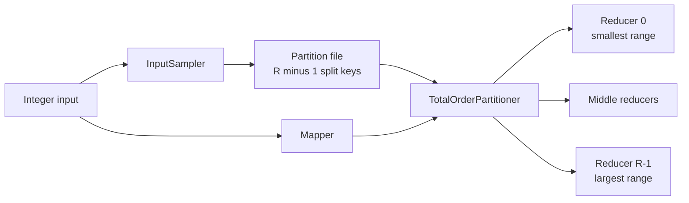

# Exercise 1 — Hadoop Total-Order Integer Sort

Status: Proposed

Runtime: Hadoop 3.2.1, Java 8 bytecode

Project: `integer-sort`

## 1. Objective

Sort a dataset of signed 32-bit integers in ascending order with Hadoop MapReduce.

The current `IntegerSortJob` is the first implementation: it uses one reducer and produces one globally sorted output file. After that baseline is verified, the scalable extension uses multiple reducers and total-order partitioning while preserving global order across the reducer output files.

This exercise is independent of Exercise 2 (Top K). It does not implement or invoke Top K.

## 2. Input and Output

Each input line contains one base-10 signed integer:

```text
42
-7
0
42
```

Leading and trailing whitespace is accepted. Empty lines are skipped and counted by `EMPTY_LINES`. Invalid values and integer overflow are skipped and counted by `MALFORMED_LINES`.

The output contains every valid integer exactly once per input occurrence. Duplicates are preserved:

```text
-7
0
42
42
```

## 3. Phase A — Verify the Current One-Reducer Job

No scalable-sort implementation begins until the current job passes its existing tests.

Required behavior:

- Ascending numeric order, including negative values.
- Duplicate preservation.
- Correct invalid-input counters.
- Exit code `2` for missing input/output arguments.
- Exactly one output file named `part-r-00000`.

Run with Maven when Maven is available:

```bash
cd integer-sort
mvn clean test
```

Run the lightweight test with the Hadoop libraries already in the NameNode container:

```bash
docker cp integer-sort namenode:/tmp/integer-sort

docker exec namenode sh -c '
  mkdir -p /tmp/integer-sort/classes &&
  javac -cp "$(hadoop classpath)" \
    -d /tmp/integer-sort/classes \
    /tmp/integer-sort/src/main/java/com/example/hadoop/IntegerSortJob.java \
    /tmp/integer-sort/src/test/java/com/example/hadoop/IntegerSortJobSmokeTest.java &&
  java -cp "/tmp/integer-sort/classes:$(hadoop classpath)" \
    com.example.hadoop.IntegerSortJobSmokeTest
'
```

The final line must be:

```text
PASS: all IntegerSortJob smoke tests
```

## 4. Phase B — Scalable Global Sort

### 4.1. Requirements

The future scalable job must:

- Accept `<input> <output> <reducers>`.
- Require at least two reducers.
- Use `IntWritable` as the shuffle key.
- Preserve duplicates and existing input-counter behavior.
- Generate exactly `reducers - 1` strictly increasing split keys.
- Assign ascending, non-overlapping key ranges to reducer IDs.
- Produce one `part-r-NNNNN` file per reducer.
- Guarantee global order when part files are read by reducer number.

The cross-file invariant is:

```text
max(part-r-i) <= min(part-r-(i+1))
```

Empty reducer partitions are allowed.

### 4.2. Architecture



For split keys `25`, `50`, and `75`:

```text
Reducer 0: key < 25
Reducer 1: 25 <= key < 50
Reducer 2: 50 <= key < 75
Reducer 3: key >= 75
```

Hadoop sorts keys inside each reducer. The ordered, non-overlapping ranges make the collection of part files globally sorted.

### 4.3. Partition generation

Use Hadoop `InputSampler` to sample input keys, sort the sample with the job comparator, and write a `SequenceFile` containing the split keys. Configure `TotalOrderPartitioner<IntWritable, NullWritable>` to read that partition file.

Initial lab defaults:

| Setting | Value |
|---|---:|
| Sampling probability | `0.10` |
| Maximum samples | `10000` |
| Maximum sampled splits | `10` |

The partition file must use a unique staging path and must be cleaned up after the job. The job must fail clearly if it cannot produce enough distinct split keys; it must never silently fall back to hash partitioning.

### 4.4. Proposed command

```bash
hadoop jar integer-sort.jar \
  com.example.hadoop.TotalOrderIntegerSortJob \
  <input> <output> <reducers>
```

The output directory must not already exist. The job does not delete existing user output.

## 5. Tests

Implementation must follow red-green-refactor and cover:

- Current one-reducer regression behavior.
- `R` reducers require `R - 1` split keys.
- Keys below, equal to, and above boundaries enter the correct reducer.
- Equal keys always enter the same reducer.
- Every part file is internally ascending.
- Adjacent part-file boundaries satisfy the global-order invariant.
- Concatenated parts equal a hand-derived sorted fixture.
- Duplicates across different map inputs are preserved.
- Invalid-input counters are correct.
- Insufficient distinct sample keys produce a clear failure.
- Reducer counts smaller than two return exit code `2`.

The integration fixture must contain multiple input files and create multiple map inputs.

## 6. Acceptance Criteria

Exercise 1 is complete when:

- The original one-reducer tests still pass.
- At least two reducers execute in the scalable test.
- The number of part files equals the reducer count.
- Every valid record appears exactly once across all part files.
- Duplicates are preserved.
- Each part is ascending.
- Adjacent part boundaries are ordered.
- Concatenating parts in reducer-number order is globally ascending.
- Invalid-input counters match the fixture.
- No hash-partitioner fallback is possible.

## 7. Non-goals

- Top K or smallest K.
- Descending sort.
- Secondary sort.
- Spark.
- Automatic MapReduce-on-YARN cluster configuration.
- A production claim based only on local test data.

## 8. References

- [Apache Hadoop TeraSort](https://hadoop.apache.org/docs/current/api/org/apache/hadoop/examples/terasort/package-summary.html)
- [Apache Hadoop TotalOrderPartitioner](https://hadoop.apache.org/docs/current/api/org/apache/hadoop/mapred/lib/TotalOrderPartitioner.html)
