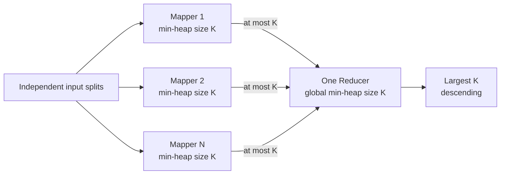

# Exercise 2 — Hadoop Largest Top K

Status: Proposed

Runtime: Hadoop 3.2.1, Java 8 bytecode

Project: `integer-sort`

## 1. Objective

Find the largest `K` signed integers using Hadoop MapReduce without globally sorting or shuffling the complete dataset.

Each Mapper calculates its local Top K. One Reducer merges only those candidates to calculate the global Top K.

This is an independent exercise. It does not depend on the output, partition file, reducer ranges, or implementation from Exercise 1.

## 2. Input and Output

Input contains one base-10 signed 32-bit integer per line. Leading and trailing whitespace is accepted.

Input handling:

| Input | Behavior |
|---|---|
| Valid integer | Consider it for Top K |
| Empty line | Skip and increment `EMPTY_LINES` |
| Invalid value or overflow | Skip and increment `MALFORMED_LINES` |

The output contains the largest `min(K, validRecordCount)` values in descending order. Duplicate occurrences count as separate records.

Example:

```text
Input:  9, -2, 9, 3, 15
K:      3
Output: 15, 9, 9
```

## 3. Requirements

The job must:

- Accept `<input> <output> <k>`.
- Reject `K <= 0` with exit code `2`.
- Maintain at most `K` integers in each task heap.
- Emit at most `K` candidates from each Mapper.
- Use one Reducer to produce the final result.
- Preserve duplicate occurrences.
- Return all valid values when `K` exceeds the valid record count.
- Produce an empty successful result when no valid values exist.
- Write the final values in descending numeric order.
- Preserve the shared malformed- and empty-line counter behavior.

## 4. Architecture



## 5. Mapper Algorithm

Each Mapper maintains a Java `PriorityQueue<Integer>` as a min-heap:

```text
For each valid value:
    if heap.size < K:
        insert value
    else if value > heap.minimum:
        remove minimum
        insert value
```

In `cleanup`, the Mapper emits each retained candidate. It emits no more than `K` records regardless of the number of input records in its split.

Using `<` rather than `<=` when replacing the minimum does not remove already-retained duplicates; duplicate values remain separate heap entries whenever they belong in the largest K occurrences.

## 6. Reducer Algorithm

The single Reducer consumes all mapper candidates and applies the same size-`K` min-heap algorithm. After input is exhausted, it copies the retained values to a list, sorts that list in descending order, and writes it.

For `M` mappers, candidate shuffle volume is bounded by:

```text
M * K records
```

The complete input is not globally sorted. This reduction in shuffle volume is the central lesson of Exercise 2.

## 7. Proposed Command

```bash
hadoop jar integer-sort.jar \
  com.example.hadoop.TopKJob \
  <input> <output> <k>
```

Example:

```bash
hadoop jar integer-sort.jar \
  com.example.hadoop.TopKJob \
  /training/top-k/input \
  /training/top-k/output \
  10
```

The output directory must not already exist. The job must not delete existing user output.

## 8. Counters

Required counters:

```text
EMPTY_LINES
MALFORMED_LINES
VALID_RECORDS
CANDIDATES_EMITTED
```

`CANDIDATES_EMITTED` counts mapper candidates sent to the Reducer. It allows the exercise to verify that mapper-local aggregation reduced shuffle volume.

## 9. Tests

Implementation must follow red-green-refactor and cover:

- A standard fixture returns the largest K values in descending order.
- Duplicate values count as separate records.
- Negative integers are compared correctly.
- `K = 1` returns the maximum value.
- `K` larger than the valid record count returns all valid values.
- Empty input produces an empty successful output.
- Malformed and empty records update counters but never enter heaps.
- Every Mapper emits no more than `K` candidates.
- The Reducer retains no more than `K` values.
- `K <= 0` and missing arguments return exit code `2`.
- Multiple input files produce the same result as the hand-derived fixture.

Tests must use multiple map inputs for the global-merge case; a single Mapper would not prove that mapper-local candidates are merged correctly.

## 10. Acceptance Criteria

Exercise 2 is complete when:

- Output equals the hand-derived largest-K fixture.
- Output record count is `min(K, validRecordCount)`.
- Values are descending.
- Duplicate occurrences are preserved correctly.
- Each Mapper emits at most `K` candidates.
- Invalid-input counters match the fixture.
- Task memory usage for the selection heap is proportional to `K`, not input size.
- The job runs directly on raw integer input and does not require Exercise 1.

## 11. Non-goals

- Global sorting of the input dataset.
- Reading total-sort output.
- Smallest K.
- Approximate Top K.
- Top K grouped by another key.
- Spark.
- Automatic MapReduce-on-YARN cluster configuration.

## 12. Implementation Order

After the user tests the current code and explicitly requests this exercise:

1. Write failing Top K tests using multiple input files.
2. Implement the mapper-local min-heap.
3. Implement the single global reducer heap.
4. Add descending output ordering.
5. Add counters and argument validation.
6. Run automated tests and a manual HDFS example.

No Top K production code is authorized by this specification alone.
