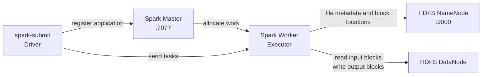

# Spark Integer Sort

This Java/Spark exercise sorts the same HDFS input used by `integer-sort` so the Spark and Hadoop MapReduce implementations can be compared directly.

The program:

1. reads a text file where each line should contain one signed 32-bit integer;
2. trims whitespace;
3. converts valid records to Spark SQL `INT` values;
4. discards blank, malformed, decimal, and out-of-range records;
5. preserves duplicate integers;
6. performs a distributed global ascending sort; and
7. writes CSV part files to HDFS.

## Architecture



The Spark worker is a compute role; the HDFS DataNode is a storage role. They happen to share a Docker network, but one Spark worker is not equivalent to one DataNode.

## How the code works

The input DataFrame initially has one string column named `value`:

```text
+-----------+
|value      |
+-----------+
|9          |
|not-a-number|
|-2         |
+-----------+
```

This expression safely parses the input:

```java
expr("try_cast(trim(value) AS INT)")
```

Invalid values become `null`, and the filter removes them. The resulting DataFrame has one integer column named `num`.

```java
.orderBy(col("num").asc())
```

`orderBy` requests a global order. Spark creates a shuffle with range partitioning and sorts the rows in those partitions. The transformations are lazy: execution starts when the output `write` action runs.

`sorted.explain(true)` prints the logical and physical plans. Look for operators similar to:

```text
Sort [num ASC NULLS FIRST]
+- Exchange rangepartitioning(num ASC NULLS FIRST, ...)
```

Spark writes an output directory, not a single named file. It can contain multiple `part-*.csv` files plus `_SUCCESS`. Do not add `coalesce(1)` for large data because that forces the final output through one partition.

## Project structure

```text
spark-sort/
├── pom.xml
├── README.md
├── src/main/java/com/example/spark/SparkSortDF.java
└── src/test/java/com/example/spark/SparkSortDFSmokeTest.java
```

The Spark dependency has Maven scope `provided`. It is available while compiling, but Spark supplies its own libraries at runtime, so those large libraries are not copied into the application JAR. Build artifacts under `target/`, including JAR files, are ignored by Git.

## 1. Start HDFS and Spark

Run from the repository root:

```bash
docker compose up -d namenode datanode spark-master spark-worker
docker compose ps
```

Useful web interfaces:

- HDFS NameNode: <http://localhost:9870>
- HDFS DataNode: <http://localhost:9864>
- Spark Master: <http://localhost:8080>

The ResourceManager and NodeManager are not required because this exercise uses Spark Standalone rather than Spark on YARN.

## 2. Build the Spark JAR

If Maven is installed on the host:

```bash
cd spark-sort
mvn clean package
cd ..
```

If Maven is not installed, build with Docker instead:

```bash
docker run --rm \
  -v "$PWD/spark-sort:/work" \
  -v spark-sort-m2:/root/.m2 \
  -w /work \
  maven:3.9.9-eclipse-temurin-17 \
  mvn clean package
```

The application JAR is:

```text
spark-sort/target/spark-sort-1.0-SNAPSHOT.jar
```

## 3. Upload the shared input to HDFS

The Hadoop and Spark jobs should read exactly the same HDFS file:

```bash
docker cp integer-sort/input/numbers.txt namenode:/tmp/numbers.txt

docker exec namenode hdfs dfs -mkdir -p \
  /training/integer-sort/input

docker exec namenode hdfs dfs -put -f \
  /tmp/numbers.txt \
  /training/integer-sort/input/numbers.txt

docker exec namenode hdfs dfs -cat \
  /training/integer-sort/input/numbers.txt
```

Create a dedicated output parent and allow the Spark container user to write there. This is a one-time setup for a new HDFS volume:

```bash
docker exec namenode hdfs dfs -mkdir -p \
  /training/spark-sort

docker exec namenode hdfs dfs -chown \
  spark:supergroup /training/spark-sort
```

Keep the permission scoped to `/training/spark-sort`; there is no need to make all of `/training` world-writable.

## 4. Submit the Spark job

Copy the small application JAR into the master container:

```bash
docker cp \
  spark-sort/target/spark-sort-1.0-SNAPSHOT.jar \
  spark-master:/tmp/spark-sort.jar
```

Submit it to the standalone Spark cluster:

```bash
docker exec spark-master \
  /opt/bitnami/spark/bin/spark-submit \
  --class com.example.spark.SparkSortDF \
  --master spark://spark-master:7077 \
  --deploy-mode client \
  /tmp/spark-sort.jar \
  hdfs://namenode:9000/training/integer-sort/input/numbers.txt \
  hdfs://namenode:9000/training/spark-sort/output
```

Why the full `hdfs://namenode:9000/...` URI is used:

- Spark containers do not automatically inherit the Hadoop containers' configuration files.
- `namenode` is resolvable because all services use `bigdata-net`.
- executors obtain block locations from the NameNode and transfer file data directly to/from the DataNode.

The output mode is `overwrite`, so rerunning this Spark job replaces only `/training/spark-sort/output`.

## 5. Inspect the Spark result

```bash
docker exec namenode hdfs dfs -ls \
  /training/spark-sort/output

docker exec namenode hdfs dfs -cat \
  '/training/spark-sort/output/part-*'
```

Expected valid values for the supplied sample:

```text
-321235
-100
-100
-2
0
3
7
9
9
9
15
42
```

The number of output part files is not fixed. `spark.sql.shuffle.partitions` defaults to 200 in Spark 3.5, while Adaptive Query Execution can merge small post-shuffle partitions. The small sample will normally be collapsed to very few partitions.

## 6. Run the smoke test

Compile the main and test classes using the Maven container:

```bash
docker run --rm \
  -v "$PWD/spark-sort:/work" \
  -v spark-sort-m2:/root/.m2 \
  -w /work \
  maven:3.9.9-eclipse-temurin-17 \
  mvn test-compile
```

Create a temporary test JAR containing both class directories:

```bash
docker run --rm \
  -v "$PWD/spark-sort:/work" \
  -w /work \
  maven:3.9.9-eclipse-temurin-17 \
  jar --create \
  --file target/spark-sort-smoke-tests.jar \
  -C target/classes . \
  -C target/test-classes .
```

Run it through `spark-submit` in local mode:

```bash
docker run --rm \
  -v "$PWD/spark-sort:/work" \
  -w /work \
  bitnamilegacy/spark:3.5.0 \
  /opt/bitnami/spark/bin/spark-submit \
  --master 'local[2]' \
  --class com.example.spark.SparkSortDFSmokeTest \
  /work/target/spark-sort-smoke-tests.jar
```

The final success message is:

```text
PASS: all SparkSortDF smoke tests
```

Use `spark-submit`, not plain `java`, because the Spark launcher configures the required classpath and JVM module options.

## 7. Compare the Hadoop and Spark results

Run the Hadoop job using the instructions in `integer-sort/README.md`, then run the Spark job above.

Both implementations now have the same output meaning: one sorted row per valid input occurrence. Neither implementation counts or aggregates duplicate values. For example, three input rows containing `9` produce three output rows containing `9` in both jobs.

Save both HDFS results on the host:

```bash
mkdir -p comparison-output

docker exec namenode hdfs dfs -cat \
  /training/integer-sort/output/part-r-00000 \
  > comparison-output/hadoop.txt

docker exec namenode hdfs dfs -cat \
  '/training/spark-sort/output/part-*' \
  > comparison-output/spark.txt
```

Confirm both outputs are already numerically sorted:

```bash
sort -n comparison-output/hadoop.txt \
  | diff -u comparison-output/hadoop.txt -

sort -n comparison-output/spark.txt \
  | diff -u comparison-output/spark.txt -
```

No output from either `diff` means that result was already sorted. Compare the values:

```bash
diff -u \
  comparison-output/hadoop.txt \
  comparison-output/spark.txt
```

No output means both programs produced exactly the same ordered values.

### What is being compared?

| Topic | Hadoop MapReduce exercise | Spark SQL exercise |
|---|---|---|
| Input | HDFS text | Same HDFS text |
| Parsing | Java in the Mapper | Spark SQL `try_cast` |
| Invalid rows | Skipped; recorded in invalid-record counters | Filtered; no invalid-record counter yet |
| Duplicate output | Preserved: one row per occurrence | Preserved: one row per occurrence |
| Distributed ordering | Shuffle/sort by mapper key | Range shuffle plus SQL sort |
| Parallel compute unit | Mapper/reducer task | Spark task in an executor |
| Compute service | Current lab uses LocalJobRunner; YARN is optional | Spark standalone master/worker |
| Output | `part-r-00000` with one reducer | One or more `part-*.csv` files |
| Repeated jobs | Starts a new MapReduce job each time | A long-lived Spark application can reuse executors and cached data |
| Best fit | Durable batch pipelines and simple MapReduce flows | Iterative, interactive, SQL, and multi-stage processing |

The current Hadoop exercise forces one reducer, while Spark's `orderBy` remains partitioned and AQE may change its final partition count. This is a correctness and architecture comparison, not a strict performance benchmark.

### Timing experiment

Once both clusters are already running, prefix each submission command with `/usr/bin/time -p` and repeat each test several times. Record at least:

- input size;
- Hadoop execution mode and reducer count;
- Spark worker cores/memory and shuffle partition count;
- wall-clock time;
- output size and part-file count; and
- whether the first run was a cold run.

Do not draw performance conclusions from `numbers.txt`: framework startup dominates such a tiny workload. For a meaningful benchmark, generate a much larger deterministic input, run both jobs against the same HDFS file, verify equal results, discard warm-up runs, and compare medians rather than a single run.

## Official references

- [Spark application submission](https://spark.apache.org/docs/3.5.8/submitting-applications.html)
- [Spark `Dataset.orderBy`, `repartitionByRange`, and `sortWithinPartitions`](https://spark.apache.org/docs/3.5.7/api/java/org/apache/spark/sql/Dataset.html)
- [Spark SQL shuffle partitions and Adaptive Query Execution](https://spark.apache.org/docs/3.5.5/sql-performance-tuning.html)
- [Spark standalone cluster](https://spark.apache.org/docs/3.5.0/spark-standalone.html)
